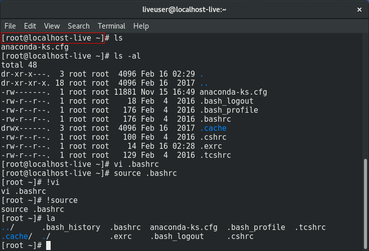

리눅스 시작하기
==============

# 1. 리눅스 기초
## 1.1. 리눅스의 구조

+ 커널(Kernel) - 리눅스의 핵심
	+ 프로세스/메모리/파일시스템/장치 관리
	+ 컴퓨터의 모든 자원 초기화 및 제어 기능
+ 쉘(Shell) - 사용자 인터페이스
	+ 명령해석
	+ 프로그래밍
	+ 리눅스 기본 쉘: bash 쉘(리눅스 쉘)
+ 응용 프로그램
	+ 각종 프로그래밍 개발도구
	+ 문서편집도구
	+ 네트워크 관련 도구 등

***
# 2. 리눅스 환경 구축
## 2.1. 가상머신(Virtual Machine)
### 2.1.1. 가상머신(Virtual Machine) 이란?
PC에 설치되어 있는 운영체제(호스트 OS)에 가상의 머신을 생성한 후 여기에 다른 운영체제(게스트 OS)를 설치할 수 있도록 해주는 응용 프로그램

### 2.1.2. 가상머신의 종류
+ VMWare
+ Hyper-V
+ VirtualBox

### 2.1.3. Oracle VM VirtualBox 설치
버추얼박스 사이트에서 다운로드
[https://www.virtualbox.org/wiki/Downloads](https://www.virtualbox.org/wiki/Downloads)

### 2.1.4. 가상머신 만들기
Fedora 워크스테이션 설치

## 2.2. 페도라(Fedora) 설치하기
### 2.2.1. 디스크 파티션 수동 설정하기
기본 디스크 파티션: 스왑(swap), boot 파티션(/boot), root 파티션(/)

|마운트 포인트|내용|
|:---|:---|
|/|Root 파티션으로 시스템 설정 등 주요 내용 저장|
|/boot|부팅 커널 저장|
|/usr|명령어, 응용 프로그램 등 저장|
|/var|로그파일 등 저장|
|/tmp|임시 파일 저장|
|/home|사용자 홈 디렉토리 저장|
|/Swap|메모리 부족시 사용, 통상 RAM 크기의 두배 설정|

## 2.3. 리눅스 터미널
## 2.3.1. 터미널(Terminal) 이란?
+ 컴퓨터와 사용자간의 소통시켜주는 인터페이스이다.
+ 리눅스 터미널은 텍스트 기반 인터페이스를 지원한다.
+ 터미널은 쉘(Shell)을 기본적으로 사용하고 있다(쉘은 문자 기반의 명령어를 컴퓨터 언어로 변환하여 컴퓨터와 소통을 가능하게 해준다).

### 2.3.2. 터미널 동작시키기
+ 프로그램 표시 -> 유틸리티 -> 터미널


### 2.3.3. 프롬프트 기호와 홈 디렉터리
+ 프롬프트
	+ 사용자의 명령 입력을 기다리는 표시
	+ 쉘에 따라 다르게 나타남: 배시 쉘의 경우 $로 표시, 시스템 관리자의 경우 #으로 표시



+ 기본 디렉터리
	+ 터미널 창의 기본 디렉터리는 사용자의 홈 디렉터리
	+ "liveuser@localhost:~" : liveuser는 사용자 계정 이름, localhost는 호스트 이름, ~는 user1 사용자의 홈 디렉터리
	+ 사용자의 홈 디렉터리는 사용자 계정을 등록할 때 지정

## 2.4. 페도라 리눅스 초기 설정
### 2.4.1. root 계정 접속
+ su 명령으로 현재 사용중인 계정을 변경한다.
+ 패스워드를 입력하고 프롬프트를 확인하여 계정이 변경되었는지 확인
+ 형식: su [사용자명]

정상적으로 root 계정으로 접속이 되었는지 확인하려면, 프롬프트에서 $ 표시가 # 표시로 변경되었는지 확인하면 된다.
```
[user@localhost ~]$ su
password: [패스워드 입력]
[root@localhost /home/user]#
```

### 2.4.2. 사용자 편의 설정: ~/.exrc
vi 에디터를 사용할 때, 설정할 매크로를 정의해 놓는 파일이다.
```
[root@localhost ~]# cat >> .exrc
set nu ai sm
^D
[root@localhost ~]#
```

+ .exrc 파일은 홈 디렉터리에 위치해야한다.
+ root 계정이라면 /root 디렉터리에 있어야한다.
+ set nu : vi 에디터에 번호를 표시
+ set ai : 윗라인과 같이 자동으로 들여쓰기
+ set sm : 괄호 강조
+ 필요한 옵션은 set 다음 이어서 작성하면 된다.

### 2.4.3. 사용자 편의 설정: ~/.bashrc
bash를 사용할 때, bash가 참고할 사항을 정의해 놓는 파일이다.
```
[root@localhost ~]# vi .bashrc
```
~/.bashrc 파일을 vi 에디터로 열어서 수정한다.
```
[기존에 정의되있는 내용]
...
alias c='clear'
alias h='history'
alias la='ls -acF'

export PS1='[\u \w]\$ '
~
~
~
".bashrc"
```
+ alias로 명령어를 축약하여 정의했다.
	+ [alias c='clear'] : 'clear' 명령어를 'c'로 줄여서 사용
	+ [alias h='history'] : 'history' 명령어를 'h'로 줄여서 사용
	+ [alias la='ls -acF'] : 'ls -acf' 명령어를 'la'로 줄여서 사용
	+ ~/.bashrc에 alias로 정의된다고 해서 그 명령어를 사용할 수 없는건 아니다.
+ export로 환경변수 PS1을 설정했다.
	+ [export PS1='[\u \w]\$ '] : 프롬프트를 형식을 변경한다.
		+ \u : 사용자 이름
		+ \w : 현재 경로

~/.bashrc 수정 후 source 명령으로 적용한다.
```
[root@localhost ~]# source .bashrc
[root ~]#
```
