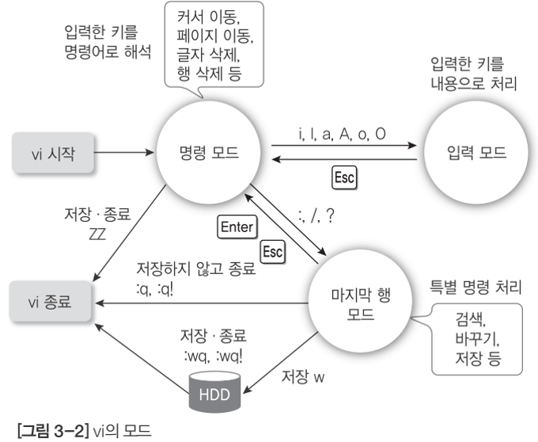

문서 편집하기
============

# 1. 리눅스의 문서 편집하기
## 1.1. 리눅스 편집기의 종류
### 1.1.1. 리눅스 편집기의 종류
+ GUI 환경인 GNOME에서 제공하는 gedit
+ 유닉스에서부터 사용했던 행 편집기(라인 편집기)와 화면 편집기

|구분|종류|
|---|---|
|행 단위 편집기|ed, ex, sed|
|화면 단위 편집기|vi, emacs(이맥스)|
|GUI 편집기|gedit|

### 1.1.2. 행 단위 편집기
+ ed : 유닉스 초기의 행 편집기로 사용이 불편하여 거의 사용되지 않음.
+ ex : 행 편집기이지만 단독을 ㅗ사용하기보다는 vi에 연결하여 vi를 더욱 강력하게 하는 다양한 기능을 제공
+ sed : 스트림 편집기로, 일반 편집기와 달리 지시된 명령에 따라 파일의 내용을 일관ㄹ적으로 바꿔서 출력해줌

### 1.1.3. 화면 단위 편집기
+ vi : 리눅스에서 일반적으로 사용할 수 있는 화면 편집기
+ emacs(이맥스) : 제공하는 기능이 매우 다양하지만 사용법이 어렵고 복잡하여 전문적인 애호가 위주로 사용

### 1.2.4. 모드형과 비모드형 편집기
+ 모드형
	+ 입력 모드와 명령 모드가 구분
	+ 입력 모드는 텍스트를 입력할 수 있는 모드이고, 명령 모드는 텍스트를 수정하거나 삭제하고 복사와 붙이기 등 편집을 하는 모드
	+ 같은 글자라도 입력 모드에서는 텍스트로 처리하여 입력되고, 명령 모드에서는 텍스트로 입력되는 것이 아니라 편집 명령으로 사용
	+ vi는 모드형 편집기
+ 비모드형
	+ 입력 모드와 명령 모드가 구분되어 있지 않음
	+ 편집 기능을 Ctrl이나 Alt 같은 특수 키와 함께 사용
	+ 한글과 워드는 비모드형 편집기

|구분|모드형(vi)|비모드형(메모장)|
|:---:|---|---|
|복사|yy|Ctrl + c|
|붙이기|p|Ctrl + v|
|저장|:wq, ZZ|Ctrl + s|

# 2. vi 에디터
## 2.1. vi 에디터 사용하기
### 2.1.1. vi의 동작 프로세스


### 2.1.2 vi 시작하기
+ 해당 파일이 있으면 파일의 내용을 볼 수 있다.
+ 없는 파일이면 빈 파일이 열리며 저장 시 새로 생성한다.

```
[root ~]# vi text
```

+ 파일을 지정하지 않을 경우 그냥 빈 파일이 열린다(파일명은 저장할 때 지정 가능)

```
[root ~]# vi
```

### 2.1.3. vi 종료하기
+ 명령모드나 마지막행 모드에서 저장하고 종료 가능

|구분|명령 키|기능|
|---|---|---|
|마지막 행 모드|:q|vi에서 작업한 것이 없을 때 그냥 종료한다.|
|마지막 행 모드|q!|작업한 내용을 저장하지 않고 종료한다.|
|마지막 행 모드|:w [파일명]|작업한 내용을 저장만 한다. 파일명을 지정하면 새 파일로 저장한다.|
|마지막 행 모드|:wq, :wq!|작업한 내용을 저장하고 vi를 종료한다.|
|명령 모드|ZZ(Sihft+zz)|작업한 내용을 저장하고 vi를 종료한다.|

### 2.1.4. 입력 모드로 전환하기
입력 모드 전환 명령 키

|명령 키|기능|
|---|---|
|i|커서 앞에 입력한다(현재 커서 자리에 입력한다).|
|a|커서 뒤에 입력한다(현재 커서 다음 자리에 입력한다).|
|o|커서가 위치한 행의 다음 행에 입력한다.|
|l|커서가 위치한 행의 첫 칼럼으로 이동하여 입력한다.|
|A|커서가 위치한 행의 마지막 칼럼으로 이동하여 입력한다.|
|O|커서가 위치한 행의 앞 행에 입력한다.|

### 2.1.5. 내용 삭제하기
내용 삭제 명령 키

|명령 키|기능|
|---|---|
|x, #x|커서 위치의 글자를 삭제한다. #에는 삭제할 글자 수를 지정한다. 예를 들어 3x는 세 글자를 삭제한다.|
|dw, #dw|커서 위치의 단어를 삭제한다. #에는 삭제할 단어 수를 지정한다.|
|dd, #dd|커서 위치의 행을 삭제한다. #에는 삭제할 행의 수를 지정한다. 예를 들어 5dd는 커서 위치부터 다섯 행을 삭제한다.|
|D(Shift+d)|커서 위치부터 행의 끝까지 삭제한다.|

### 2.1.6. 명령 취소하기
이전 명령 취소 명령 키

|명령 키|기능|
|---|---|
|u|명령을 취소한다.|
|U|해당 행에서 한 모든 명령을 취소한다.|
|:e!|마지막으로 저장한 내용 이후의 것을 버리고 새로 작업한다.|

### 2.1.7. 복사하기 또는 잘라서 붙이기
복사하기, 잘라내기, 붙이기 명령 키

|명령 키|기능|
|---|---|
|yy, #yy|커서가 위치한 행을 복사한다. #에는 복사할 행의 수를 지정한다. 예를 들어 3yy는 세 행을 복사한다.|
|p|커서가 위치한 행의 아래쪽에 붙인다.|
|P|커서가 윛한 행의 위쪽에 붙인다.|
|dd, #dd|커서가 위치한 행을 잘라둔다. 삭제와 같은 기능이다. #에는 잘라둘 행의 수를 지정한다. 예를 들어 3dd는 세 행을 잘라둔다.|

## 2.2. vi 환경 설정
### 2.2.1. .exrc 파일에 설정하기
사용자 홈 디렉터리에 .exrc 파일로 저장

```
[root@localhost ~]# cat >> .exrc
set nu ai sm
^D
[root@localhost ~]#
```

+ set nu : vi 에디터에 번호를 표시
+ set ai : 윗라인과 같이 자동으로 들여쓰기
+ set sm : 괄호 강조
+ 필요한 옵션은 set 다음 이어서 작성하면 된다.
